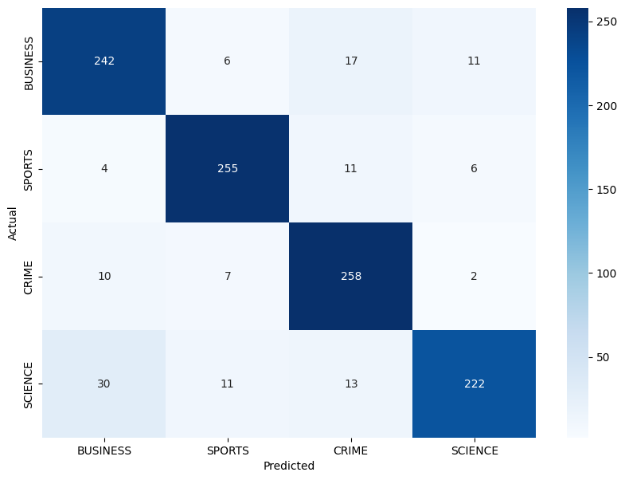

# New Category Classifier using Bag of N grams

A Bag of N-Grams is a text representation method used in natural language processing (NLP). It involves breaking down text into a collection (bag) of contiguous sequences of 'N' items (grams). Each 'gram' can be a word or a character, depending on the specific application.

For example:

- Unigrams (1-grams): "Natural Language Processing" → ["Natural", "Language", "Processing"]
- Bigrams (2-grams): "Natural Language Processing" → ["Natural Language", "Language Processing"]
- Trigrams (3-grams): "Natural Language Processing" → ["Natural Language Processing"]

This method captures contextual information and word order, which helps in tasks like text classification, sentiment analysis, and more. The "bag" aspect indicates that the sequence of n-grams is treated as a collection where the order does not matter, focusing instead on the frequency and presence of n-grams.

## Result: Confusion Matrix

